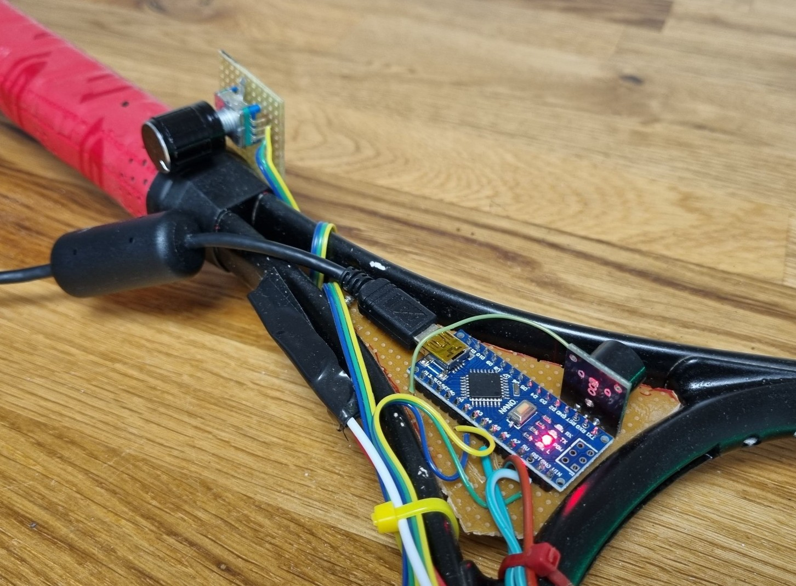

# Halloween Zombie Sensor

An Arduino, a LED strip, a summer a rotary encoder... And a tennis racket!  
I built this as a "zombie infection scanner" for Halloween, but it could be used for anything that you can imagine! Radiation scanner or alien detector? It's up to you!

Turn the color and beep intensity by the wheel for your thumb. Won't be noticeable by anyone at a first look!

## Hardware

Cheap generally available standard components:

* Arduino Nano
* EC11 rotary encoder
* KY-012 Piezo summer
* WS2812 LED strip
* Some prototype PCB
* A tennis racket or similar

Most components could probably be replaced by others without much effort.

**Mounting example**

## Software

 Easily extendable non-blocking loop to handle both input and outputs.

* FastLED Arduino library to talk to the WS2812 LED strip
* Teensy Encoder library to handle the rotary encoder.

### Todo

Can we use the push-button of the rotary encoder for something fun?

## Dress up!

### Some inspiration:

* Sunglasses
* Gas mask or face mask
* Hazmat suit or Tyvek coverall

### Welcome!

